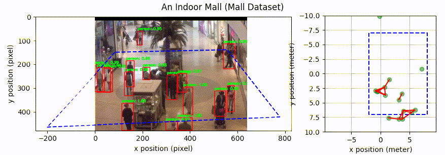

# social-distancing-monitoring
A Vision-based Social Distancing and Critical Density Detection System for COVID-19

Developed by Dongfang Yang and Ekim Yurtsever.
[Control and Intelligent Transportation Research (CITR) Lab](http://citr.osu.edu/), The Ohio State University.

Paper: [arXiv preprint](https://arxiv.org/abs/2007.03578)

**Note**: We are still in the process of finalizing the repository. The complete version will be released soon!

## System Overview

Our system is real-time and does not record data. An audio-visual cue is emitted each time an individual breach of social distancing is detected. We also make a novel contribution by defining a critical social density value for measuring overcrowding. Entrance into the region-of-interest can be modulated with this value.

## Social Distancing Monitoring

Illustration of pedestrian detection and social distancing monitoring.

## Camera calibration

NYC Grand Central terminal: We found the floor plan of the building and calibrated the camera by picking landmarks. We provide the transformation matrix in 
calibration/grand_central_matrix_cam2world.txt

Oxford town center: The original dataset provides the transformation matrix. We added it here also calibration/oxford_town_matrix_cam2world.txt

Mall: We could not found the transformation matrix or the floor plan of this dataset. Instead, we first estimated the size of a reference object in the image by comparing it with the width of detected  pedestrians  and  then  utilized  the  key  points  of  the reference object to calculate the perspective transformation. We provide this transformation matrix in calibration/mall_matrix_cam2world.txt

## Critical Density

Keeping the social density under the critical value will keep the probability of social distancing violation occurrence near zero with the linear regression assumption.

## TODO Lists

- [x] Social distancing monitoring pipeline
- [x] Evaluation on different pedestrian crowd datasets
- [x] Detector: Faster R-CNN
- [x] Detector: Yolo v4
- [ ] Detector: EfficientDet
- [x] Critical density analysis
- [ ] Embedded system integration
- [ ] Camera calibration UI

<!-- ## Getting Started

(1) Download the video datasets:
   - Oxford Town Center Dataset: [Download](http://www.robots.ox.ac.uk/ActiveVision/Research/Projects/2009bbenfold_headpose/Datasets/TownCentreXVID.avi)
   - Mall Dataset
   - Grand Central Train Station Dataset:

(2) Put the dataset videos into `datasets` folder.

(3) Run `main.py` script.

## Issues
- [ ] Faster/Mask RCNN performs bad on grand central datasets: they cannot detect all pedestrians with a score threshold of 0.7.
  - Planning to try Yolo-v4 and EfficientDet
- [ ] Mall dataset only provides individual frames. They claim that the FPS is less than 2, but do not indicate the exact FPS, so I assume the FPS is just 1 FPS -->

## Contact

For further info please contact:
- Dongfang Yang: yang.3455@osu.edu
- Ekim Yurtsever: yurtsever.2@osu.edu
